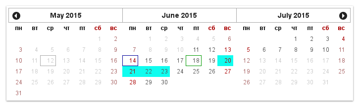

# Gregory

[](https://travis-ci.org/fiskus/gregory)
[](https://david-dm.org/fiskus/gregory)
[](http://github.com/badges/stability-badges)

React calendar component.

## Name

There is no good and vacant names, so: calendar → Gregorian calendar → Gregory.

## [Examples](examples)



```js
var React = require('react');
var Calendar = require('gregory');

function onDatePicked(date) {
  console.log(date);
}

React.render(
  <Calendar CLASSNAME="cldr"
            UI_HAS_SIX_ROWS={false}
            ON_SELECT={onDatePicked} />,
  document.getElementById('calendar')
);
```

## Compatibility

In theory: IE9+ now, IE8+ with polyfills (shims alter environment, so that they aren't included).

In practice: tested on modern browsers only.

## Installation

Gregory is available as an [npm package](https://www.npmjs.com/package/gregory):

```sh
npm install gregory
```

## Options

There are three categories of options

### Base options

* `CLASSNAME` sets prefix for all elements classnames
* `ON_SELECT` is callback on clicked/selected cell with enabled date

### Date options

* `DATE_CURRENT` is default/current date for calendar
* All dates above `DATE_MAX` are disabled/unselectable
* All dates behind `DATE_MIN` are disabled/unselectable

### UI options

* `UI_DAY_CLASSNAME` sets function for adding classNames to day-cell
* `UI_DAY_RENDER` sets middleware function for day-cell render
* `UI_FORMAT_MONTH` sets format of current month at header ([See moment.js documentation](http://momentjs.com/docs/#/displaying/format/))
* `UI_HAS_SIX_ROWS` sets showing of six rows always even for February
* `UI_HAS_WEEKDAYS` sets visibility of header with weekdays captions
* `UI_MONTHS_NUMBER` sets number of months
* `UI_TEXT_NEXT` sets caption for next-month button
* `UI_TEXT_PREV` sets caption for prev-month button
* `UI_WEEKDAYS` is array of weekdays captions

## Contributing

```sh
npm install
npm start # build examples and start server
npm test # tests and linting
```

See [gulpfile](gulpfile.js) for more usefull tasks.

* 4 spaces for indentation
* No classes or prototypes, just functions
* If function should use this.props, pass it as first argument
* Priority: simplicity > consistency > performance

## License
MIT
